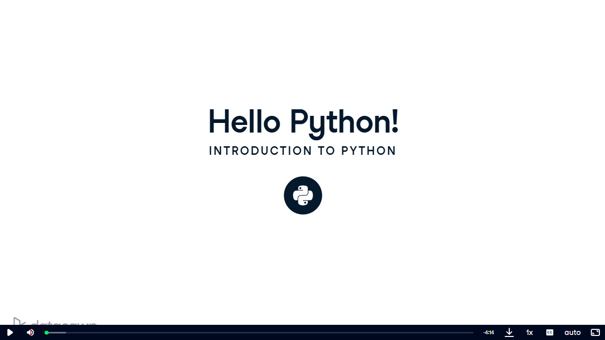
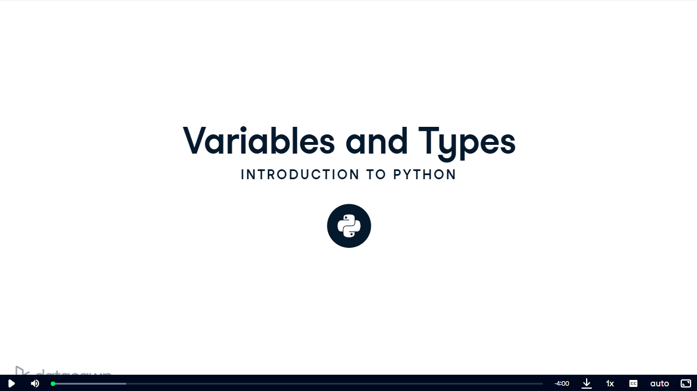
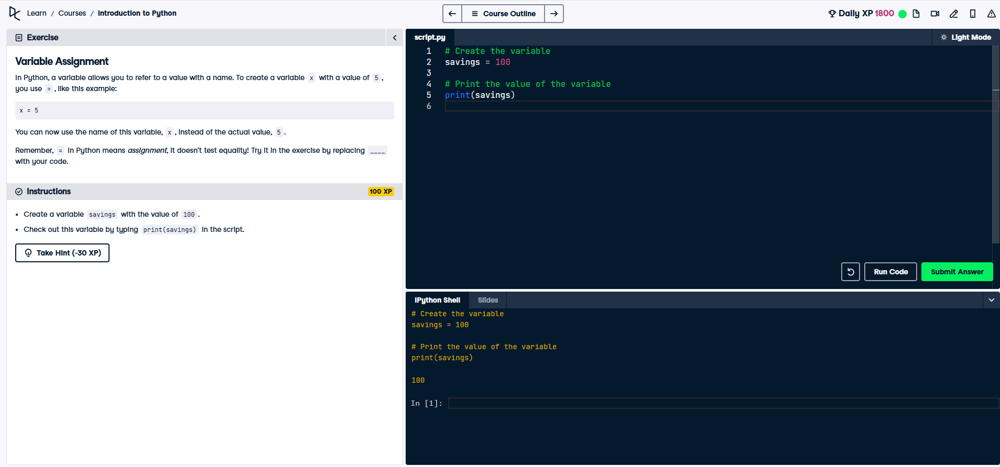
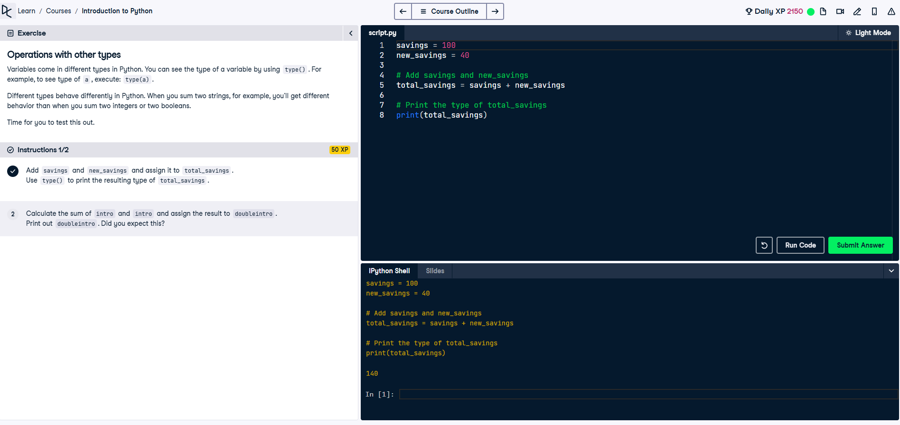
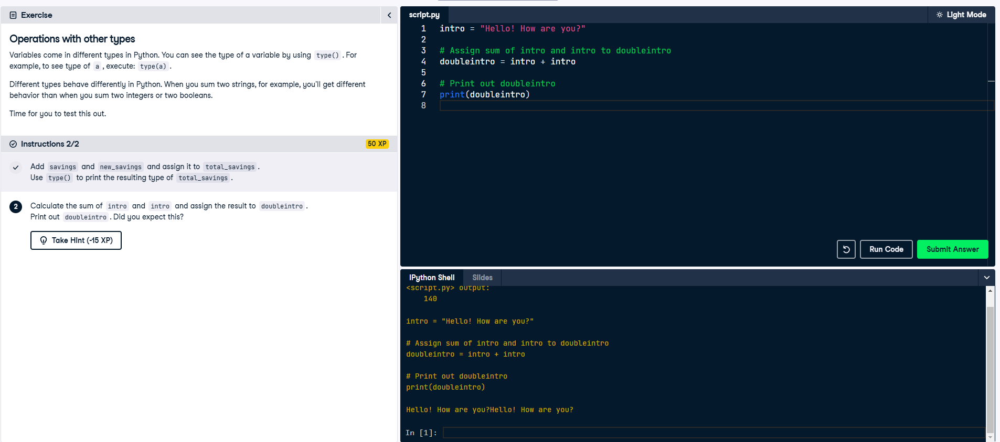
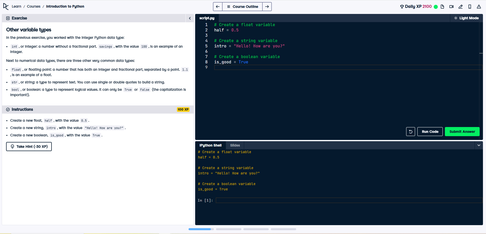
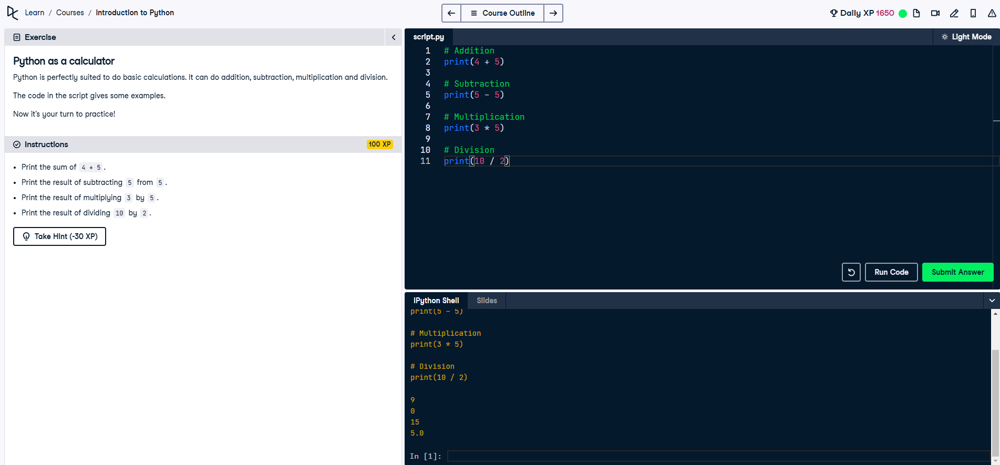
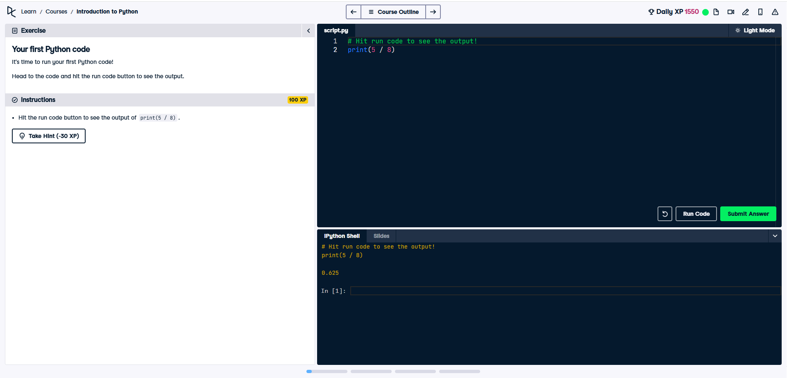
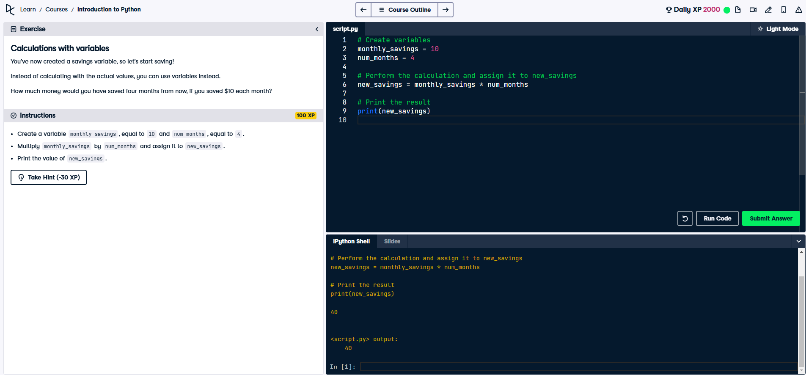

# Python Basics: Introduction to Python

This repository contains an **Introduction to Python** tutorial, organized into fundamental topics for beginners. Each section includes explanations and visual aids (images) for clarity.

---

## Table of Contents
1. [Introduction to Python](#introduction-to-python)
2. [Variables and Types](#variables-and-types)
3. [Variable Assignment](#variable-assignment)
4. [Operations with Variables](#operations-with-variables)
5. [Other Variable Types](#other-variable-types)
6. [Python as a Calculator](#python-as-a-calculator)
7. [Your First Python Code](#your-first-python-code)
8. [Calculations with Variables](#calculations-with-variables)

---

## 1. Introduction to Python
This section explains what Python is, its basic syntax, and why it is an excellent choice for beginners.

**Image Reference:**

---

## 2. Variables and Types
Learn about Python variables, their types, and how to declare them.

**Image Reference:**

---

## 3. Variable Assignment
Understand how variables are assigned in Python and the use of the assignment operator `=`.

**Image Reference:**

---

## 4. Operations with Variables
Explore performing operations with variables, including numerical and string operations.

### Part 1: Numerical Operations
Examples of operations such as addition, subtraction, multiplication, and division.

**Image Reference:**

### Part 2: String Operations
Operations like string concatenation, repetition, and slicing.

**Image Reference:**

---

## 5. Other Variable Types
Introduction to data types like lists, dictionaries, and booleans.

**Image Reference:**

---

## 6. Python as a Calculator
Use Python as a powerful calculator to perform basic and advanced mathematical computations.

**Image Reference:**

---

## 7. Your First Python Code
Write and execute your first Python program. A step-by-step guide for running Python code.

**Image Reference:**

---

## 8. Calculations with Variables
Learn how to combine variables and perform calculations.

**Image Reference:**

---

## How to Use This Repository
1. Review each section in sequence.
2. Follow along with the examples in a Python IDE or Jupyter Notebook.
3. Refer to the images for visual explanations.

---

## Prerequisites
- Python installed on your machine (version 3.x recommended).
- A code editor (e.g., VSCode, PyCharm) or Jupyter Notebook.

---

This tutorial provides a foundational understanding of Python programming. Feel free to expand upon these concepts as you progress.

---

**Author**: Yengkong Sayaovong  
**License**: MIT  
"""

